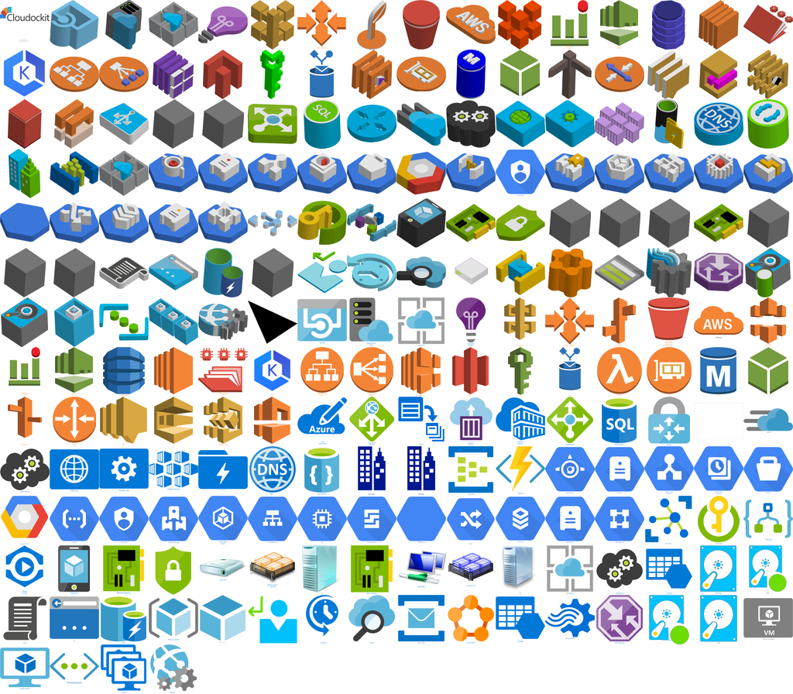
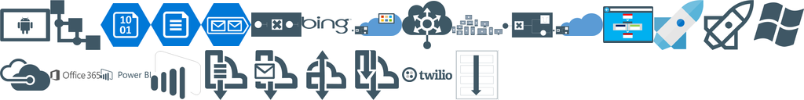
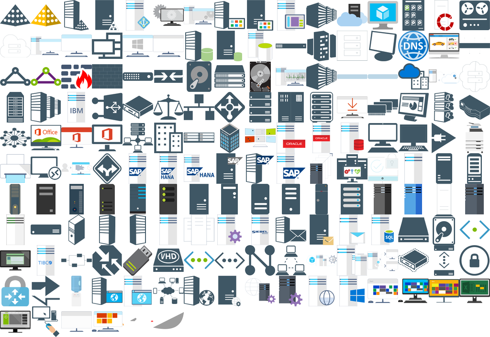
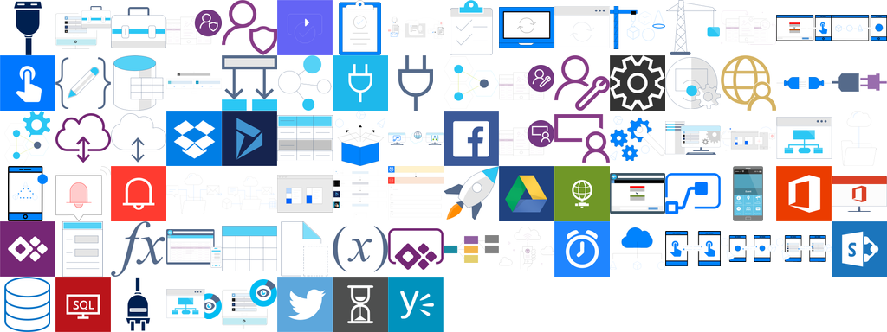

# Microsoft Visio Stencils

Tool to extract shaped from Visio Stencils:  
https://gallery.technet.microsoft.com/Visio-2013-Shape-Exporter-15bdaeec

### Stencils used to extract the shapeds

- Office Visio Stencil: https://www.microsoft.com/en-us/download/details.aspx?id=35772
- Microsoft Integration Stencils Pack: https://gallery.technet.microsoft.com/Collection-of-Integration-e6a3f4d0
- Microsoft Azure Cloud and AI Symbol / Icon Set https://www.microsoft.com/en-us/download/details.aspx?id=41937
- Skype and Teams, Visio Stencil https://gallery.technet.microsoft.com/Skype-and-Teams-Visio-27979e95
- System Center v.Next Visio Stencils https://gallery.technet.microsoft.com/System-Center-vNext-Visio-affea756

## Folder angularx

## Folder atlassianx

## Folder azure-aws-gcp-diagramstencilx

## Folder microsoft_integration_stencils_v3.1.0x

## Folder mis_additional_or_support_stencils_v3.1.0x

## Folder mis_apps_and_systems_logo_stencils_v3.1.0x

## Folder mis_azure_additional_or_support_stencils_v3.1.0x

## Folder mis_azure_others_stencils_v3.1.0x

## Folder mis_azure_stencils_v3.1.0x

## Folder mis_buildings_stencils_v3.1.0x

## Folder mis_databases_stencils_v3.1.0x

## Folder mis_deprecated_stencils_v3.1.0x

## Folder mis_developer_stencils_v3.1.0x

## Folder mis_devices_stencils_v3.1.0x

## Folder mis_files_stencils_v3.1.0x

## Folder mis_generic_stencils_v3.1.0x

## Folder mis_infrastructure_stencils_v3.1.0x

## Folder mis_iot_devices_stencils_v3.1.0x

## Folder mis_powerapps_and_flows_stencils_v3.1.0x

## Folder mis_power_bi_stencils_v3.1.0x

## Folder mis_users_and_roles_stencils_v3.1.0x

## Folder office_365_products_stencilx

## Folder Services

## Folder sfbo_teams_stencil_by_ucblogmx_v2.0x

## Folder system_center_v.next_visio_stencils_v0.95x

